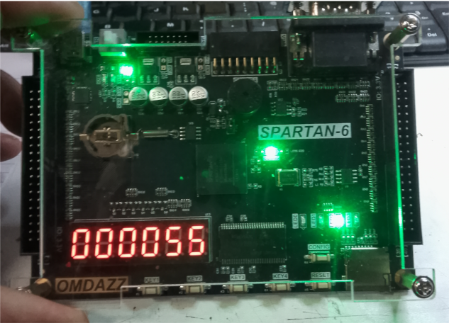

# Xilinx ISE 14.7 — Docker Setup Guide
### Running a Legacy FPGA Toolchain on Modern Linux
### MD HARRINGTON BEXLEYHEATH KENT LONDON DA68NP
---

## Table of Contents

1. [What is an FPGA?](#what-is-an-fpga)
2. [What is Verilog?](#what-is-verilog)
3. [Why the Spartan-6 Development Board?](#why-the-spartan-6-development-board)
4. [Why Docker?](#why-docker)
5. [How This Setup Works](#how-this-setup-works)
6. [Downloading the Xilinx ISE Installer](#downloading-the-xilinx-ise-installer)
7. [Preparing Your Folder Structure](#preparing-your-folder-structure)
8. [Prerequisites — X11 Display Setup](#prerequisites--x11-display-setup)
9. [Running `docker_setup.sh`](#running-docker_setupsh)
10. [Running `setup_ise.sh`](#running-setup_isesh)
11. [Using the ISE Docker Manager](#using-the-ise-docker-manager)


---
<div align="center">
  
</div>

---

## What is an FPGA?

**FPGA** stands for **Field-Programmable Gate Array**. To understand what that means, it helps to contrast it with the kind of chip inside every laptop and phone — a **CPU** (Central Processing Unit).

A CPU is a fixed piece of silicon. Its transistors are permanently wired at manufacture to perform general-purpose computation: fetch an instruction, decode it, execute it, repeat. It is flexible in *software* but rigid in *hardware*.

An FPGA is fundamentally different. Its internal structure — the actual logic gates and the connections between them — **can be reconfigured after manufacture**, as many times as you like. You are not writing software that runs on fixed hardware; you are **describing hardware itself**, and the chip rearranges its internals to become that hardware.

### The Silicon Fabric

Inside an FPGA are hundreds of thousands (or millions) of tiny configurable blocks:

- **LUTs (Look-Up Tables)** — small programmable logic units that can implement any boolean function
- **Flip-Flops** — storage elements for holding state between clock cycles
- **Block RAM** — dedicated on-chip memory
- **DSP slices** — hard-wired multiplier/accumulator blocks for signal processing
- **I/O blocks** — configurable pins that connect to the outside world
- **Programmable interconnect** — a vast routing fabric that wires everything together

When you "program" an FPGA, you are downloading a **bitstream** — a configuration file — that sets millions of tiny switches, determining which LUTs connect to which flip-flops, which outputs route to which inputs, and what logic each LUT implements.

### Why Would You Use an FPGA Instead of a CPU or GPU?

| Situation | Best Choice | Why |
|---|---|---|
| General-purpose software | CPU | Flexible, easy to program, fast for sequential tasks |
| Parallel floating-point math | GPU | Thousands of cores optimised for matrix operations |
| Fixed, ultra-fast parallel logic | FPGA | True hardware parallelism, deterministic timing, reconfigurable |
| Custom hardware protocol | FPGA | Can implement *any* interface at the logic level |
| Low-latency real-time control | FPGA | No OS overhead, nanosecond-level response times |
| Prototyping an ASIC design | FPGA | Test real hardware behaviour before committing to silicon |

FPGAs excel where you need **massive parallelism**, **precise timing control**, or the ability to implement **custom digital logic** that no standard chip provides. Common applications include digital signal processing, software-defined radio, high-frequency trading systems, motor controllers, video processing pipelines, and prototyping custom processor designs.

The trade-off is that FPGAs are more complex to design for than writing software — you must think in terms of hardware: clock domains, propagation delays, resource utilisation, and simultaneous signal flow rather than sequential instruction execution.

---

## What is Verilog?

**Verilog** is a **Hardware Description Language (HDL)** — a language used to describe the structure and behaviour of digital circuits. It looks superficially similar to C in its syntax, but its underlying model is completely different: rather than describing a sequence of instructions for a processor to execute, Verilog describes **concurrent hardware that operates simultaneously**.

### A Simple Example

Here is a 4-bit counter in Verilog:

```verilog
module counter (
    input  wire       clk,    // clock signal
    input  wire       reset,  // synchronous reset
    output reg  [3:0] count   // 4-bit output
);

always @(posedge clk) begin
    if (reset)
        count <= 4'b0000;
    else
        count <= count + 1;
end

endmodule
```

This describes a real hardware circuit: a register that increments on every rising edge of the clock signal. When synthesised, the FPGA tools turn this into actual LUTs and flip-flops on the chip.

### Key Concepts

**Modules** are the building blocks of Verilog — equivalent to components or chips. Each module has inputs, outputs, and internal logic. Large designs are built by connecting modules together hierarchically, just as a PCB connects physical ICs.

**`always` blocks** describe behaviour that occurs in response to signal changes. `always @(posedge clk)` means "do this on every rising clock edge" — this maps directly to flip-flop behaviour in real hardware.

**Concurrency** is the most important concept to grasp. In software, lines of code execute one after another. In Verilog, all `always` blocks and `assign` statements run **simultaneously**, reflecting the reality that all parts of a circuit operate in parallel. This is the fundamental mental shift required when moving from software to hardware design.

**Synthesis** is the process of converting Verilog source code into a netlist — a description of which gates and flip-flops to use and how to connect them. The Xilinx ISE toolchain performs this synthesis, then maps the netlist onto the specific resources available on your target FPGA.

### Verilog vs VHDL

The other major HDL is **VHDL**, which is more verbose and strongly typed. Verilog is generally considered more concise and is widely used in industry and academia. ISE supports both; this setup is oriented around Verilog but works equally well with VHDL designs.

---

## Why the Spartan-6 Development Board?

The **Xilinx Spartan-6** is a family of FPGAs introduced in 2009, positioned as a low-cost, low-power option for embedded and educational applications. Despite being a mature platform, it remains an excellent choice for learning FPGA development and building real projects.

### The Spartan-6 Family at a Glance

The family spans a range of sizes, from the tiny XC6SLX4 up to the XC6SLX150T. Common development boards use the **XC6SLX9** or **XC6SLX16**, which offer a practical balance of resources for learning and small projects:

| Resource | XC6SLX9 | XC6SLX16 |
|---|---|---|
| Logic cells | 9,152 | 14,579 |
| Block RAM | 32 × 18Kb | 32 × 18Kb |
| DSP48A1 slices | 16 | 32 |
| Maximum user I/O | 200 | 232 |
| Clock management | 4 DCM/PLL | 4 DCM/PLL |

### Why Choose Spartan-6 for Learning?

**Cost.** Spartan-6 development boards are widely available for £20–£80 depending on peripherals included. This is far more accessible than modern Artix-7 or Kintex boards, while still providing a fully capable FPGA environment.

**Toolchain availability.** ISE 14.7 fully supports Spartan-6 and is provided free of charge under the WebPACK licence — no paid licence is required for these devices. Modern Xilinx/AMD tools (Vivado) do *not* support Spartan-6, making ISE the only official option.

**Community and resources.** Because Spartan-6 has been around for over 15 years, there is an enormous body of tutorials, example projects, and forum discussions covering virtually every aspect of the platform. This makes it far easier to find help when stuck.

**Real-world applicability.** The fundamental concepts learned on Spartan-6 — clock domain crossing, state machines, bus interfaces, timing constraints — transfer directly to more modern FPGAs. The architecture is different in scale but not in principle.

**Peripheral richness on popular boards.** Common Spartan-6 development boards (such as the Papilio, Nexys 3, Mimas, or various Chinese boards) include onboard LEDs, buttons, VGA output, UART, SPI flash, SDRAM, and PMOD connectors — enough to build substantial real projects without additional hardware.

### Why ISE Rather Than a Newer Toolchain?

Xilinx replaced ISE with **Vivado** from 2013 onwards, but Vivado deliberately dropped support for all 7-series predecessors including Spartan-6. If you own a Spartan-6 board, **ISE 14.7 is the only official Xilinx toolchain that will synthesise and program it**. There is no upgrade path — which is exactly why this Docker setup exists: to keep ISE running on modern Linux systems long after its native environment became obsolete.

---

## Why Docker?

**Xilinx ISE 14.7** is a legacy FPGA design suite that was last updated in 2013. It is a **32-bit application** built for Ubuntu 14.04 and older Red Hat-based Linux distributions. It will **not run natively** on any modern Linux system (Ubuntu 22.04+, Fedora 38+, etc.) because:

- Modern distributions have dropped most 32-bit library support
- System libraries have changed in ways that break ISE's old binaries
- The installer itself expects a specific environment that no longer exists by default

**Docker** solves this by creating a **self-contained, isolated environment** — essentially a lightweight virtual machine — running Ubuntu 14.04, complete with all the old 32-bit libraries that ISE requires. Your host system stays clean and modern, while ISE lives happily inside its frozen-in-time container.

### Key Benefits of this Approach

| Problem | Docker Solution |
|---|---|
| ISE needs Ubuntu 14.04 libs | Container runs Ubuntu 14.04 in isolation |
| 32-bit dependencies conflict with host | Libraries are contained, never touch your host |
| Installer breaks on modern kernels | Container provides a compatible environment |
| USB/JTAG programmer needs hardware access | `--privileged` flag passes USB devices through |
| GUI tools need a display | X11 forwarding pipes the window to your desktop |

---

## How This Setup Works

The setup is split across **two scripts** that work in sequence:

### `docker_setup.sh` — Builds the Docker Image

This script does the heavy lifting:

1. **Installs Docker** on your host system via `apt`
2. **Extracts** the Xilinx ISE installer from the `.tar` archive
3. **Creates a `Dockerfile`** that describes an Ubuntu 14.04 environment pre-loaded with all required 32-bit libraries
4. **Creates `ise_config.txt`** — a silent installer config that tells the Xilinx installer which components to install and where
5. **Builds the Docker image** (`xilinx-ise`) by bundling the installer and config into the container

The resulting Docker image is a snapshot of a working Ubuntu 14.04 system, ready to run the Xilinx installer or the ISE tools themselves.

### `setup_ise.sh` — Creates Your Launcher

This script creates a management menu (`ise-docker`) and installs it as a global command. Once run, you can type `ise-docker` from anywhere in a terminal to:

- Open a shell inside the container
- Run the ISE graphical installer (`xsetup`)
- Launch the ISE design GUI
- Launch iMPACT (the FPGA programmer)
- Rebuild the Docker image if needed

---

## Downloading the Xilinx ISE Installer

The installer is provided **free of charge** by AMD/Xilinx (ISE is no longer sold) but requires a free account to download.

1. Go to: **https://www.xilinx.com/support/download/index.html/content/xilinx/en/downloadNav/vivado-design-tools/archive-ise.html**
2. Sign in or create a free AMD/Xilinx account
3. Find **ISE Design Suite 14.7** (the final release)
4. Download the file named:

```
Xilinx_ISE_DS_Lin_14.7_1015_1.tar
```

> **Note:** This file is approximately **6.5 GB**. Ensure you have enough disk space and a stable connection. The AMD download manager may be offered — the direct `.tar` download is preferred.

---

## Preparing Your Folder Structure

The script expects the installer `.tar` file to be at a **specific path**. You must create this folder structure manually before running anything.

### Step-by-Step

Open a terminal and run the following commands:

```bash
mkdir -p ~/Installs/Spartan6
```

This creates the nested directory structure:

```
/home/<your-username>/
└── Installs/
    └── Spartan6/
```

Now **move or copy** your downloaded tar file into that folder:

```bash
mv ~/Downloads/Xilinx_ISE_DS_Lin_14.7_1015_1.tar ~/Installs/Spartan6/
```

Verify it is in place:

```bash
ls ~/Installs/Spartan6/
# Expected output: Xilinx_ISE_DS_Lin_14.7_1015_1.tar
```

> The script looks for the file at `/home/mark/Installs/Spartan6/Xilinx_ISE_DS_Lin_14.7_1015_1.tar`. If your username is not `mark`, open `docker_setup.sh` in a text editor and update the `TAR_SRC` variable at the top of the file to match your actual home directory path.

---

## Prerequisites — X11 Display Setup

> **This step is required before running the installer GUI.** Skipping it will result in the Xilinx installer window failing to appear.

The Xilinx installer and ISE tools are **graphical applications**. When they run inside Docker, they need a way to display their windows on your desktop. Linux handles this via a system called **X11** (the display server). Docker containers don't have access to your display by default — you must explicitly grant it.

### Step 1 — Install X11 Utilities

```bash
sudo apt update
sudo apt install -y x11-xserver-utils
```

**What this does:** Installs `xhost` and related tools that control which clients are allowed to connect to your X11 display server. Without these tools installed, you cannot grant Docker access to your screen.

### Step 2 — Allow Docker to Access Your Display

```bash
xhost +local:docker
```

**What this does:** Tells your X11 display server to accept connections from any local Docker container. The `+local:docker` argument specifically permits the local Docker socket — it does not open your display to the network.

> **Important:** This command must be run **each time you log in or reboot**, as it does not persist across sessions. If ISE or the installer fails to show a window, running this command again will usually fix it.

> You will see the output: `non-network local connections being added to access control list` — this is normal and expected.

---

## Running `docker_setup.sh`

With the `.tar` file in place and Docker not yet installed, you are ready to build the image.

### Make the script executable and run it:

```bash
chmod +x ~/docker_setup.sh
./docker_setup.sh
```

### What happens, step by step:

| Stage | What You'll See |
|---|---|
| Sudo prompt | Script asks for your password to keep sudo alive throughout |
| Docker install | `apt` installs `docker.io` and enables the service |
| Archive extraction | The 6.5 GB tar is extracted — this takes several minutes |
| Dockerfile creation | Config files are written to `~/xilinx-docker/` |
| Docker build | Ubuntu 14.04 image is pulled and all libraries installed |
| Completion prompt | Asked whether to shut down — choose `n` to stay logged in |

> **The Docker build step takes the longest** — typically 10–20 minutes depending on your internet speed and CPU. A log is saved to `~/xilinx-docker/build.log` if anything goes wrong.

Once complete, confirm the image was created:

```bash
docker images | grep xilinx-ise
```

You should see `xilinx-ise` listed with a recent creation timestamp.

---

## Running `setup_ise.sh`

This script installs the `ise-docker` launcher command on your system.

```bash
chmod +x ~/setup_ise.sh
./setup_ise.sh
```

### What it does:

1. Creates `~/xilinx-docker/run_ise.sh` — the full menu-driven launcher script
2. Makes it executable
3. Creates a global symlink at `/usr/local/bin/ise-docker` so you can run it from any terminal

### Confirm the launcher is installed:

```bash
which ise-docker
# Expected output: /usr/local/bin/ise-docker
```

---

## Using the ISE Docker Manager

From any terminal, launch the manager:

```bash
ise-docker
```

You will see:

```
==================================
   Xilinx ISE Docker Manager
==================================
1) Open shell
2) Install ISE (xsetup)
3) Launch ISE GUI
4) Launch iMPACT (FPGA programmer)
5) Rebuild Docker image
6) Instructions
0) Exit
==================================
Select option:
```

### First Time — Install ISE

> Make sure you have run `xhost +local:docker` in your current session before this step.

1. Select **option 2** — this runs the Xilinx `xsetup` graphical installer inside the container
2. The installer GUI will appear on your desktop
3. Follow the on-screen steps — accept the licence, confirm the installation path (`/opt/Xilinx`)
4. The installation takes 10–20 minutes and installs ISE into the running container

> **Note:** Because Docker containers are ephemeral by default (`--rm` flag), you should not exit the container after installing. The GUI launcher options (3 and 4) are designed to be run after the installation is committed to the image or mounted as a volume. For persistent installs, consider removing `--rm` from the `docker run` commands and committing the container — or consult the instructions menu (option 6) inside the tool.

### Normal Use

| Option | What it does |
|---|---|
| **3 — Launch ISE GUI** | Opens the full ISE design environment (schematic, simulation, synthesis) |
| **4 — Launch iMPACT** | Opens the FPGA programmer — plug your board in via USB first |
| **1 — Open shell** | Drops you into a bash shell inside the container for manual commands |

### Troubleshooting

| Symptom | Fix |
|---|---|
| GUI window doesn't appear | Run `xhost +local:docker` then retry |
| iMPACT can't see USB device | Ensure board is plugged in *before* launching; check `lsusb` on host |
| `docker: command not found` | Re-run `docker_setup.sh` or install Docker manually |
| Build fails with library errors | Check `~/xilinx-docker/build.log` for the specific error |

---

*Guide covers: `docker_setup.sh` + `setup_ise.sh` — Xilinx ISE 14.7 WebPACK on Ubuntu via Docker*
